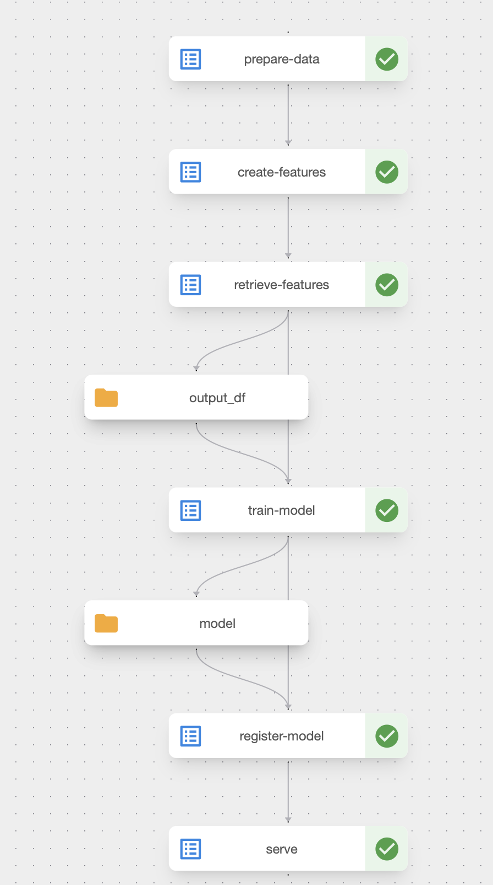

This is a work in progress.

## Pipeline



## How to navigate the code

The main entry point for understanding this project is [fraud-detection-e2e.py](pipeline/fraud-detection-e2e.py).

The container image for the pipeline is defined in the `Containerfile` located in the same directory as the pipeline definition.

Other images used in the pipeline have their code in corresponding directories. For example, the `DATA_PREPARATION_IMAGE` is defined in the [data_preparation](data_preparation) directory, and similarly for other components.

## Create a Kind cluster

```shell
kind create cluster -n fraud-detection-e2e-demo --image kindest/node:v1.31.6
```

## Deploy Kubeflow Pipelines

https://www.kubeflow.org/docs/components/pipelines/operator-guides/installation/

## MinIO

### Port forward

```shell
kubectl port-forward --namespace kubeflow svc/minio-service 9000:9000
```

### Get MinIO credentials

```shell
ACCESS_KEY=kubectl get secret mlpipeline-minio-artifact -oyaml | yq .data.accesskey | base64 --decode
SECRET_KEY=kubectl get secret mlpipeline-minio-artifact -oyaml | yq .data.secretkey | base64 --decode
```

## Upload datasets to MinIO

## Setting up MinIO

You can set up the required MinIO structure either through the UI or using the MinIO Client (mc).

### Using the MinIO UI

1. Access the MinIO UI at: http://localhost:9000
   - Username: `minio`
   - Password: `minio123`

2. Create the following directory structure and upload the files:
```
mlpipeline
└── artifacts
    └── feature_repo
        ├── data
        │   └── input
        │       ├── raw_transaction_datasource.csv
        │       ├── test.csv
        │       ├── train.csv
        │       └── validate.csv
        └── feature_store.yaml
```

## Setup

```shell
./setup.sh
```

## Upload the pipeline

```shell
kfp pipeline upload -p fraud-detection-e2e fraud-detection-e2e.yaml
```

## Run the pipeline

## Port-forward the inference pod

```shell
kubectl -n kubeflow get pods -l serving.kserve.io/inferenceservice=fraud-detection -o jsonpath="{.items[0].metadata.name}" | xargs -I {} kubectl port-forward -n kubeflow pod/{} 8081:8080
```

### Run Test Requests

With the port-forward active, test the deployed model:

#### Example 1: Checking a User with Potential Fraud

```shell
curl -i -X POST http://localhost:8081/v1/models/onnx-model:predict -H "Content-Type: application/json" -d '{"user_id": "user_0"}'
```

The request only contains the user ID. The predictor will:
1. Retrieve the user's features from Feast's online store
2. Use those features for model inference
3. Return both the prediction and the features used

Expected output:

```
HTTP/1.1 200 OK
date: Wed, 11 Jun 2025 17:12:25 GMT
server: uvicorn
content-length: 56
content-type: application/json

{"user_id":"user_0","prediction":[[0.8173668384552002]]}
```

The prediction value close to 1.0 indicates a high probability of fraud for the given user.

#### Example 2: Checking a User with Likely Non-Fraudulent Activity

```shell
curl -i -X POST http://localhost:8081/v1/models/onnx-model:predict -H "Content-Type: application/json" -d '{"user_id": "user_1"}'
```

Expected output:

```
HTTP/1.1 200 OK
date: Wed, 11 Jun 2025 17:12:28 GMT
server: uvicorn
content-length: 57
content-type: application/json

{"user_id":"user_1","prediction":[[0.18598723411560059]]}
```

The prediction value close to 0.0 indicates a low probability of fraud for the given user.
